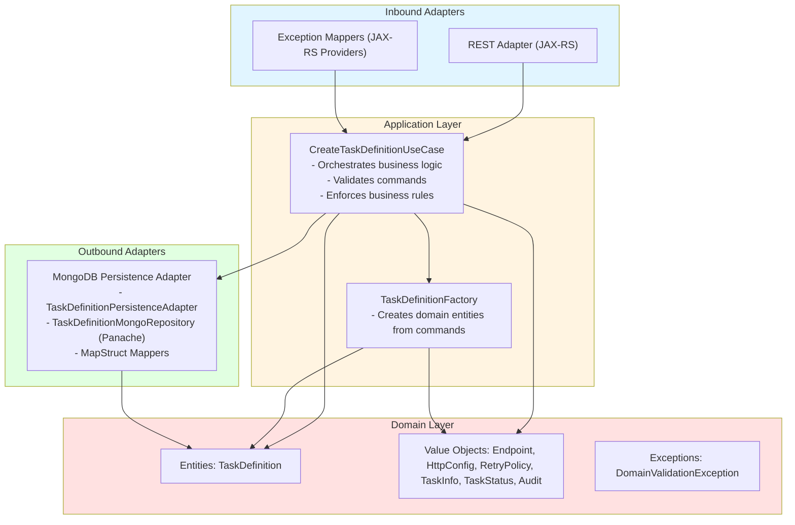

# Octopus Task Registry

[](https://openjdk.java.net/)
[](https://quarkus.io/)
[](https://www.mongodb.com/)
[](LICENSE)

**Centralized Task & Workflow Definition Repository**

The octopus-task-registry is the centralized repository for task and workflow definitions in the Octopus system. It stores configurations that are consulted by the `octopus-orchestrator` during workflow execution, acting as the single source of truth for task metadata, HTTP configurations, retry policies, and execution parameters.

## Table of Contents

- [Overview](#overview)
- [Architecture](#architecture)
- [Project Structure](#project-structure)
- [Tech Stack](#tech-stack)
- [Getting Started](#getting-started)
- [Running the Application](#running-the-application)
- [API Documentation](#api-documentation)
- [Testing](#testing)
- [Docker Support](#docker-support)
- [Configuration](#configuration)
- [Contributing](#contributing)

## Overview

The Octopus Task Registry is a microservice that provides a central API and storage for all task and workflow definitions used by the Octopus platform. It is responsible for storing, validating, and exposing task configurations, including HTTP endpoints, retry policies, and metadata. The registry is designed to be the single source of truth for the orchestrator and other services that need to query or manage task definitions.

Key features include a clear separation of concerns using hexagonal architecture, a rich domain model with value objects, robust validation at the domain level, and a REST API for managing tasks. The service is built with Quarkus for high performance and fast startup, uses MongoDB for persistence, and provides OpenAPI documentation for easy integration.

## Architecture

The project follows Hexagonal Architecture (Ports & Adapters), which ensures that the core business logic (domain) is isolated from external frameworks and infrastructure. The application layer orchestrates use cases and coordinates the flow between the domain and the adapters. Adapters handle communication with the outside world, such as REST APIs and database persistence.



The architecture uses the Factory Pattern for complex object creation, the Repository Pattern for data access abstraction, MapStruct for mapping between DTOs, domain objects, and entities, and JAX-RS Exception Mappers for consistent error handling.

## Project Structure

The project is organized in a way that reflects the hexagonal architecture. Below are the main folders and their responsibilities:

- `adapter/`: Contains inbound and outbound adapters. Inbound adapters expose REST APIs and exception mappers. Outbound adapters handle persistence (MongoDB) and mapping between domain and database entities.
- `application/`: Contains the application layer, including use cases, command objects, ports (interfaces for adapters), and factories for creating domain objects from commands.
- `domain/`: Contains the core business logic, including entities, value objects, and domain exceptions. This layer is independent of any external framework.
- `resources/`: Contains configuration files such as `application.properties`.
- `docker/`: Contains Docker and Docker Compose files for local development and deployment.
- `test/`: Contains unit and integration tests, organized by layer and responsibility.

Each folder should contain only code related to its responsibility. For example, the domain layer should not contain any code related to REST, persistence, or frameworks. The application layer should orchestrate use cases and coordinate between domain and adapters, but not contain business rules itself.

## Tech Stack

The project uses Java 21 and Quarkus 3.31.3 as the main framework. MongoDB is used for persistence, with Panache simplifying the repository pattern. REST APIs are exposed using JAX-RS, and validation is handled with Hibernate Validator. MapStruct is used for object mapping, and Lombok reduces boilerplate code. The project is containerized with Docker and Docker Compose, and OpenAPI documentation is provided via SmallRye OpenAPI.

## Getting Started

To get started, ensure you have Java 21 or higher, Maven 3.9+, Docker, and Git installed. Clone the repository and start MongoDB using Docker Compose. Then, you can run the application in development mode with live reload using `./mvnw quarkus:dev`. The application will be available at http://localhost:8080.

## Running the Application

You can run the application in development mode with live reload using:

```bash
./mvnw quarkus:dev
```

For production, package the application and run the JAR:

```bash
./mvnw clean package
java -jar target/quarkus-app/quarkus-run.jar
```

To build and run a native executable (requires GraalVM or Docker):

```bash
./mvnw package -Dnative
./target/octopus-task-registry-1.0.0-SNAPSHOT-runner
```

## API Documentation

The API is documented using OpenAPI and Swagger UI. Once the application is running, you can access the documentation at:

http://localhost:8080/q/swagger-ui/

The main endpoint for creating a task definition is:

POST /api/v1/tasks

The request body should include all required fields for the task, including name, category, description, status, metadata, httpConfig, and retryPolicy. The response will include the created task definition with all its properties.

## Testing

To run all tests, use:

```bash
./mvnw test
```

To run tests with coverage:

```bash
./mvnw verify
```

You can also run specific tests or integration tests as needed. Test code is organized by layer and responsibility, following the same structure as the main source code.

## Docker Support

Docker and Docker Compose are provided for local development. To start MongoDB and Mongo Express, use:

```bash
cd src/main/docker
docker-compose up -d
```

You can build Docker images for the application using the provided Dockerfiles. See the docker folder for details.

## Configuration

Configuration is managed in `src/main/resources/application.properties`. You can override settings using environment variables or profiles. The main variables are the MongoDB connection string, database name, and HTTP port.

## Contributing

Contributions are welcome. Please fork the repository, create a feature branch, and use Conventional Commits for your commit messages. Open a pull request when your feature is ready for review.

## License

This project is licensed under the Apache License 2.0. See the LICENSE file for details.


